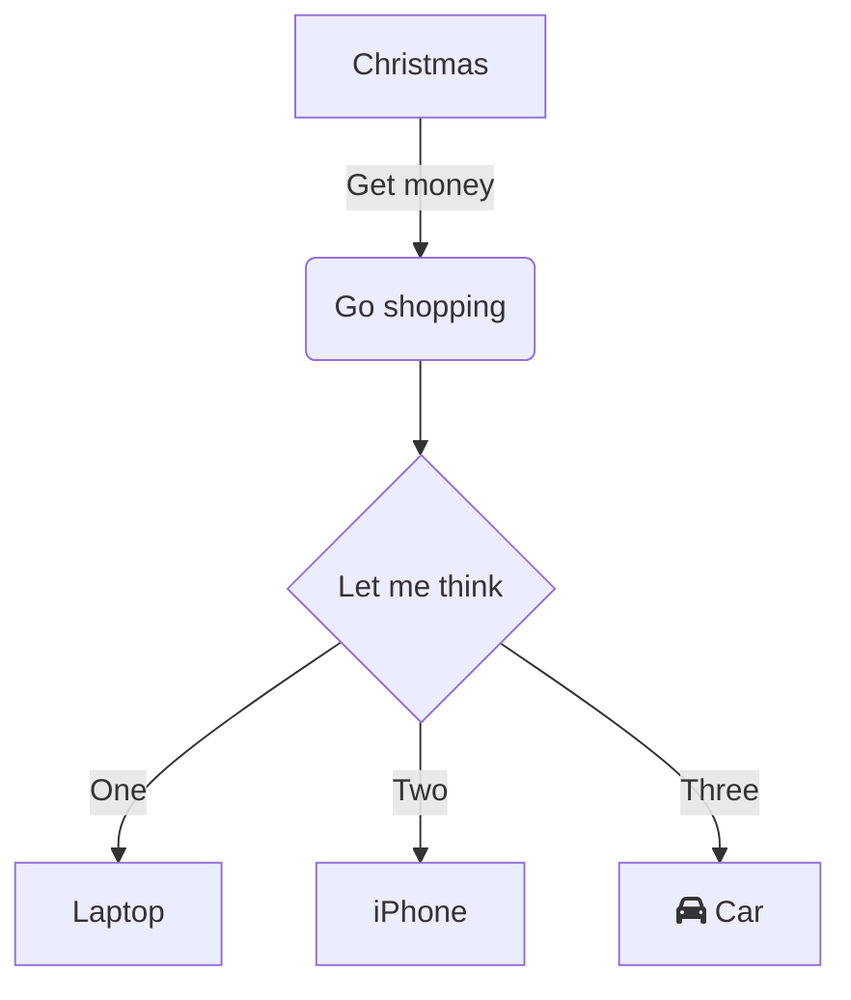

#stream 笔记


[ Node.js 流: 你需要知道的一切](https://juejin.im/post/5940a9c3128fe1006a0ab176)
[stream](https://medium.freecodecamp.org/node-js-streams-everything-you-need-to-know-c9141306be93)

[https://devhints.io/nodejs-stream](https://devhints.io/nodejs-stream)
[深入理解 Node.js Stream 内部机制](http://taobaofed.org/blog/2017/08/31/nodejs-stream/)


## base know


### Proucer–consumer problem

the producer and the consumer, who share a common, fixed-size buffer used as a queue.

The producer's job is to generate data, put it into the buffer, and start again. At the same time, the consumer is consuming the data

The problem is to make sure that the producer won't try to add data into the buffer if it's full and that the consumer won't try to remove data from an empty buffer

### pressure背压
When the receiving end of the transfer has complex operations, or is slower for whatever reason, there is a tendency for data from the incoming source to accumulate, like a clog.
生产和消费效率不一致导致数据在缓存池堆积。


## 缓冲 buffer 
1. stream 会先将数据读入buffer中， 在从buffer读取数据。
2. buffer的大小取决于highwatemark的值 一般是 64*1024bytes;


## 1. what is stream？


Streams are collections of data ,— just like arrays or strings;
1. might not be available all at once,
2. they don’t have to fit in memory
   
1. 流是数据的集合
2. 流的读写方式不是把所有数据都加载到内存中，而是连续的一点点的加载。不会消耗很多内存。
3. stream通过继承 event 获得事件监听的能力
   

## list the readStram and writeStream example?

### readStream?
1. fs.createReadStream('..')
2. http.request


### writeStream?
1. fs.createWriteStream('..')
2. http-response

### transform stream

zlib;

### duplux stream 
1.TCP socket.


## stream type?

| 类        | 使用场景                     | 重写方法             |
| --------- | ---------------------------- | -------------------- |
| Readable  | 只读                         | \_read               |
| Writable  | 只写                         | \_write              |
| Duplex    | 读写                         | \_read, \_write      |
| Transform | 操作被写入数据, 然后读出结果 | \_transform, \_flush |

## stream buffer

Both Writable and Readable streams will store data in an internal buffer;
The amount of data potentially buffered depends on the highWaterMark option passed into the stream's constructor;

commonly, the highwatermark is set to 16kb

## readstream


### readfile vs readfiles;

1.  read the file completely into memory;
2.  It will read the file in chunks of the default size 64 kb which is specified before hand.

### implement readStram;

```js
const { Readable } = require("stream");
const readStream = new Readable();
readStream.push("ABCDE====\n");
readStream.push(null);
readStream.pipe(process.stdout);
```

## writestream


### implement writeStream;

```js
const { Writable } = require("stream");
const outStream = new Writable({
  write(chunk, encoding, callback) {
    console.log(chunk.toString(), encoding, "\n");
    callback();
  }
});

process.stdin.pipe(outStream);
```

## duplex


A duplex streams is both Readable and Writable. An example of that is a TCP socket.

```js
const { Duplex } = require("stream");
const inoutStream = new Duplex({
  write(chunk, encoding, callback) {
    console.log(chunk.toString());
    callback();
  },

  read(size) {
    this.push(String.fromCharCode(this.currentCharCode++));
    if (this.currentCharCode > 90) {
      this.push(null);
    }
  }
});
inoutStream.currentCharCode = 65;
process.stdin.pipe(inoutStream).pipe(process.stdout);
```

### implement
```js
const util = require('util');
const Readable = require('_stream_readable');
const Writable = require('_stream_writable');

util.inherits(Duplex, Readable);

var keys = Object.keys(Writable.prototype);
for (var v = 0; v < keys.length; v++) {
  var method = keys[v];
  if (!Duplex.prototype[method])
    Duplex.prototype[method] = Writable.prototype[method];
}
```


## transform Stream
输入和输出之间做了一次转换。


## pipe


```js
var a = createReadableStream()
var b = anotherTypeOfStream()
var c = createWriteStream()

a.on('error', handler)
b.on('error', handler)
c.on('error', handler)

a.pipe(b).pipe(c)

function handler (err) { console.log(err) }
```


```
Readable.prototype.pipe = function(writable, options) {
  this.on('data', (chunk) => {
    let ok = writable.write(chunk);
	// 背压，暂停
    !ok && this.pause();
  });
  writable.on('drain', () => {
    // 恢复
    this.resume();
  });
  // 告诉 writable 有流要导入
  writable.emit('pipe', this);
  // 支持链式调用
  return writable;
};
```


### base


`readableSrc.pipe(writableDest)`
readStream to writeStream

```
# readable.pipe(writable)
readable.on('data', (chunk) => {
  writable.write(chunk);
});
readable.on('end', () => {
  writable.end();
});
```
### why use pump instead of pipe
If a chunk of data were to fail to be properly received, the Readable source or gzip stream will not be destroyed.


## question?
1. What is the difference between readFile vs createReadStream in Node.js?
   1. readfile会把所有的文件都加载入内存中
   2. createReadStream 按块读取文件。默认每次都读取64kb;
2. 


